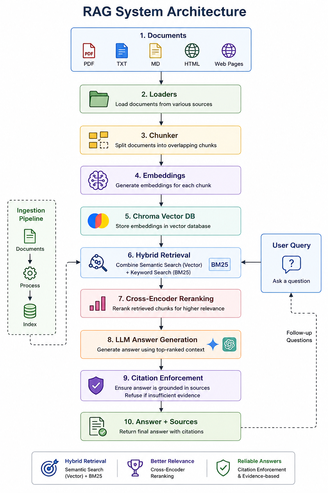
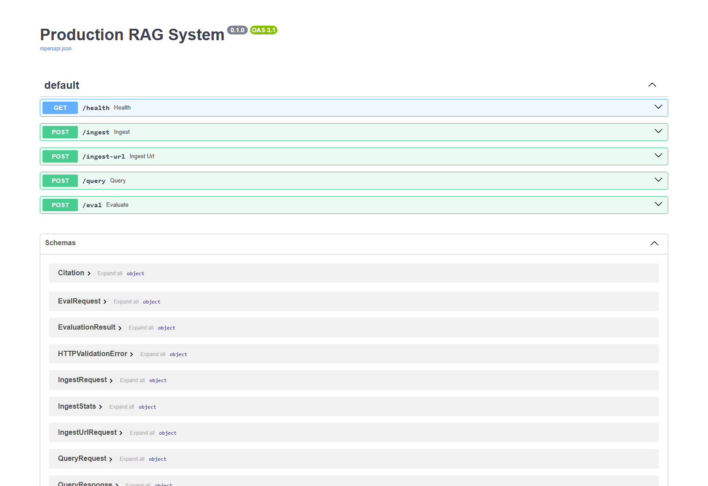

# Production RAG System

A production-style Retrieval-Augmented Generation system for asking questions over your own documents with grounded answers and citations.

The system ingests PDFs, Markdown, text, HTML files, and web pages; chunks them into overlapping token windows; stores embeddings in Chroma; retrieves relevant context with hybrid semantic + keyword search; reranks results with a local cross-encoder; and generates answers with citations using Gemini or OpenAI.

## System Preview

### RAG Architecture

The diagram below shows the end-to-end architecture: documents are loaded, chunked, embedded, stored in Chroma, retrieved with hybrid search, reranked, passed to the LLM, and returned with citations.



### Running API

The FastAPI service exposes interactive Swagger documentation for ingestion, querying, health checks, and evaluation.



## Features

- Document ingestion for local files and web pages
- Token-aware chunking with configurable overlap
- Chroma persistent vector database
- Hybrid retrieval using vector search and BM25 keyword search
- Reciprocal rank fusion for combining retrievers
- Local sentence-transformers cross-encoder reranking
- Citation enforcement with refusal when sources do not support the answer
- CLI commands for ingestion, querying, and evaluation
- FastAPI service with Swagger docs
- Versioned prompt files
- RAGAS evaluation support
- GitHub Actions CI

## How The System Works

This project has two main flows: an ingestion pipeline and a query pipeline.

### 1. Ingestion Pipeline

The ingestion pipeline prepares private documents for retrieval.

1. Documents are loaded from `data/raw`, a single file path, or a web URL.
2. Supported document types include PDF, TXT, Markdown, HTML, and web pages.
3. The loader normalizes every source into a shared document format with source metadata.
4. The chunker splits text into token-aware chunks, using a default chunk size of 700 tokens and 100 tokens of overlap.
5. Each chunk receives a stable chunk ID and metadata such as source path, page number, title, and chunk index.
6. The embedding provider creates vector embeddings for every chunk using Gemini or OpenAI.
7. Chunks and metadata are stored in ChromaDB so answers can later cite the exact source.

### 2. Query Pipeline

The query pipeline answers user questions using only indexed documents.

1. A user submits a question through the CLI or FastAPI.
2. Chroma vector search retrieves semantically similar chunks.
3. BM25 keyword search retrieves chunks that match exact terms or phrases.
4. Reciprocal rank fusion combines semantic and keyword retrieval results.
5. A local sentence-transformers cross-encoder reranks the retrieved chunks for higher precision.
6. The top-ranked chunks are formatted as context and sent to the configured LLM.
7. The LLM generates an answer using only the retrieved context.
8. The answer must include chunk citations such as `[chunk_id]`.
9. If the answer has no valid supporting citations, the system refuses instead of guessing.
10. The final response includes the answer, citations, source excerpts, retrieved chunks, and support status.

### 3. Evaluation Pipeline

The evaluation pipeline is designed for measuring RAG quality.

1. A manually verified golden QA dataset is stored as JSONL.
2. `rag eval` runs questions through the RAG pipeline.
3. RAGAS measures faithfulness, answer relevancy, context precision, and context recall.
4. GitHub Actions can fail CI if the faithfulness score drops below the configured threshold.

### 4. Provider Support

The system supports both Gemini and OpenAI.

- Gemini uses `GOOGLE_API_KEY`, `gemini_chat_model`, and `gemini_embedding_model`.
- OpenAI uses `OPENAI_API_KEY`, `chat_model`, and `embedding_model`.
- If you switch embedding providers or embedding models, delete `data/chroma` and ingest again because vector dimensions can differ.

## Project Structure

```text
.
|-- docs/assets/                     # README images and project visuals
|-- config/default.yaml              # Runtime configuration
|-- data/
|   `-- eval/golden_qa.example.jsonl # Example evaluation dataset schema
|-- prompts/                         # Versioned prompt templates
|-- src/rag_system/                  # RAG application source code
|-- tests/                           # Unit and integration tests
|-- .env.example                     # Environment variable template
|-- pyproject.toml                   # Package metadata and dependencies
`-- README.md
```

## Requirements

- Python 3.10 or newer
- A Gemini API key or an OpenAI API key
- Internet access on first run to download Python packages and the local reranker model

## Setup From Scratch

Clone the repository:

```powershell
git clone <your-github-repository-url>
cd <repository-folder>
```

Create and activate a virtual environment:

```powershell
python -m venv .venv
.\.venv\Scripts\Activate.ps1
```

Install the project:

```powershell
pip install -e ".[dev]"
```

Create your environment file:

```powershell
Copy-Item .env.example .env
```

Open `.env` and add your key. Do not commit `.env`.

For Gemini:

```env
GOOGLE_API_KEY=your-api-key-here
RAG_CONFIG_PATH=config/default.yaml
```

For OpenAI:

```env
OPENAI_API_KEY=your-api-key-here
RAG_CONFIG_PATH=config/default.yaml
```

## Configure The Model Provider

Open `config/default.yaml`.

For Gemini:

```yaml
provider: gemini
gemini_embedding_model: models/gemini-embedding-001
gemini_chat_model: gemini-2.5-flash
```

For OpenAI:

```yaml
provider: openai
embedding_model: text-embedding-3-small
chat_model: gpt-4.1-mini
```

If you switch providers after ingesting documents, delete `data/chroma` and ingest again because embedding dimensions differ across providers and models.

## Add Documents

Create the raw data folder:

```powershell
New-Item -ItemType Directory -Force data/raw
```

Put your PDFs, Markdown files, text files, or HTML files inside `data/raw`.

Supported extensions:

- `.pdf`
- `.md`
- `.markdown`
- `.txt`
- `.html`
- `.htm`

## Ingest Documents

Ingest every supported file in `data/raw`:

```powershell
rag ingest --path data/raw
```

Ingest one web page:

```powershell
rag ingest-url --url "https://example.com/page"
```

The ingestion step chunks documents, embeds them, and stores them in Chroma under `data/chroma`.

## Ask Questions

Query from the CLI:

```powershell
rag query "What are these documents about?"
```

A successful response includes:

- `answer`
- `citations`
- `retrieved_chunks`
- `supported`
- `refused`

Example shape:

```json
{
  "answer": "The document describes an industrial safety system [abc123].",
  "citations": [
    {
      "chunk_id": "abc123",
      "source": "data/raw/example.pdf",
      "page": 3,
      "excerpt": "..."
    }
  ],
  "supported": true,
  "refused": false
}
```

If the retrieved chunks do not support an answer, the system refuses instead of guessing.

## Run The API

Start the FastAPI server:

```powershell
python -m uvicorn rag_system.api:app --host 127.0.0.1 --port 8000
```

Open the Swagger UI:

```text
http://127.0.0.1:8000/docs
```

Health check:

```powershell
Invoke-WebRequest http://127.0.0.1:8000/health
```

Expected response:

```json
{"status":"ok"}
```

API endpoints:

- `GET /health`
- `POST /ingest`
- `POST /ingest-url`
- `POST /query`
- `POST /eval`

Example `POST /ingest` body:

```json
{
  "path": "data/raw",
  "recursive": true
}
```

Example `POST /query` body:

```json
{
  "question": "What are these documents about?"
}
```

## Evaluation

The example schema is in `data/eval/golden_qa.example.jsonl`.

Create your real manually verified dataset at:

```text
data/eval/golden_qa.jsonl
```

Validate the dataset format:

```powershell
rag eval --dataset data/eval/golden_qa.jsonl --validate-only
```

Run RAGAS evaluation:

```powershell
rag eval --dataset data/eval/golden_qa.jsonl --threshold 0.85
```

The CI workflow skips evaluation when the real golden dataset is missing, and fails when the dataset exists but the faithfulness score drops below the threshold.

## Run Checks

Run lint:

```powershell
ruff check . --no-cache
```

Run tests:

```powershell
python -m pytest -p no:cacheprovider
```

Check installed dependencies:

```powershell
pip check
```

## Important Security Notes

- Never commit `.env`.
- Never commit real API keys.
- Keep only placeholders in `.env.example`.
- `data/chroma`, `data/raw`, cache folders, logs, and virtual environments are ignored by Git.
- Use repository secrets for CI keys, such as `OPENAI_API_KEY` or `GOOGLE_API_KEY`.

## Troubleshooting

If queries always refuse to answer:

- Confirm documents were ingested successfully.
- Ask a question that is directly answerable from the documents.
- Check that `data/chroma` exists after ingestion.

If you changed from OpenAI to Gemini, or Gemini to OpenAI:

```powershell
Remove-Item -Recurse -Force data/chroma
rag ingest --path data/raw
```

If the reranker prints a Hugging Face token warning, it is usually safe to ignore. It only means the public model is being downloaded without an authenticated Hugging Face token.
